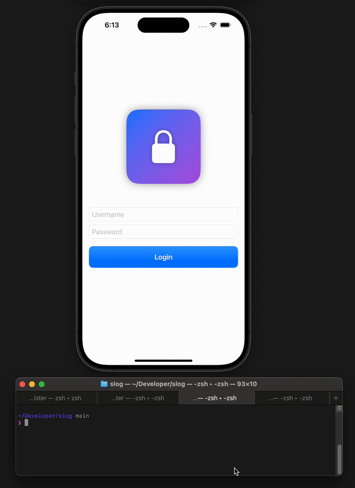

# slog
Because Simulator Logins shouldn’t be a slog.



---

## 🪵 What is slog?
A tiny CLI that launches your iOS Simulator app and taps through the login screen so you don’t have to.

- Saves/loads config at `~/.slog.json`
- EZ add & switch apps, accounts, and devices
- You're now one command away from being logged in

---

## ⚙️ Requirements
- macOS with Xcode Simulators installed (xcrun simctl available)
- Homebrew
- jq
- AXe (installed via Homebrew)

---

## 🍺 Install (Homebrew)
```bash
brew install pg8wood/tap/slog
```

---

## 🚀 Quick start
```bash

# First-time setup
slog setup

# Config
slog add                           # interactive
slog add <account|app|device>      # explicit
slog config                        # print current config

# Switching
slog switch                        # interactive
slog switch <account|app|device>   # explicit

# Login
slog                               # interactive
slog login                         # explicit
```


---

## 📝 Notes
- The first time you use orientation or menu automation, macOS may prompt Terminal for “Automation” permissions (System Events).
> [!CAUTION]
> Credentials are stored locally in `~/.slog.json`. This app is only intended to store dev credentials. It is your responsibility to maintain a higher standard of security for your production accounts. 

---

## 🧭 Roadmap
- Re-enable landscape once AXe rotation is fixed ([`AXe #5`](https://github.com/cameroncooke/AXe/issues/5))
- Keychain storage for secure accounts

